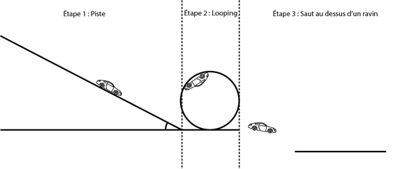

# Projet-Fast-and-Furious
Projet mécanique CPI A1 réalisé par Nathan, Valentin, Adrien et Fabien formant le groupe GP2.3.
  
Le fichier [main.py](main.py) est une simulation numérique du schéma ci-dessous. Les données peuvent être modifié dans le [donnees.json](donnees.json) pour la simulation version maquette ou directement dans le [main.py](main.py) pour le cas réel.

